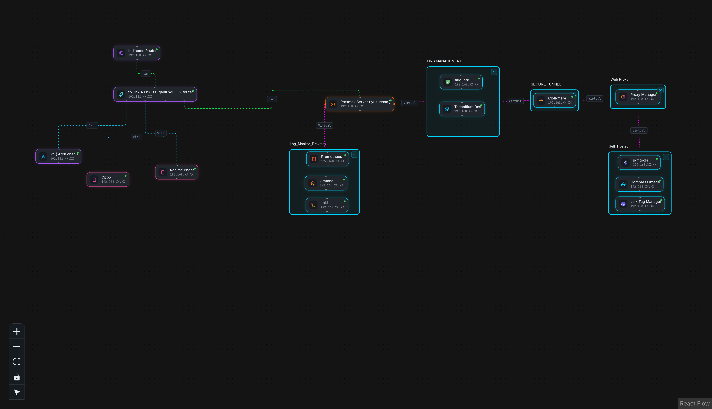
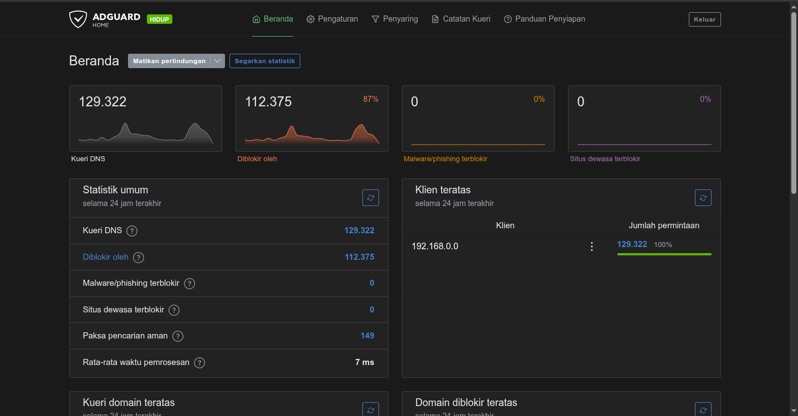
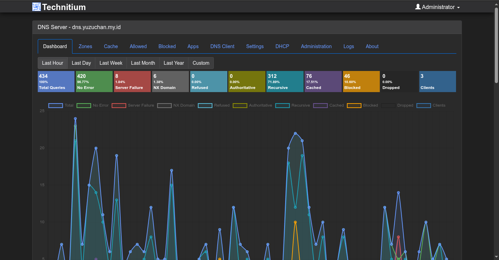

# 🚀 Home Lab & Enterprise-Grade Network Infrastructure

An end-to-end, highly secure, and resource-optimized home lab architecture running on a low-power **Proxmox VE** host (`yuzuchan`). This project demonstrates internal network segmentation, dual-layer DNS filtering, zero-trust external ingress, and centralized log/metric observability.

---

## 📐 Network Topology

---

## 🖥️ Hardware & Hypervisor Specifications

The entire virtualized infrastructure is hosted on a low-power Mini PC running the latest Proxmox VE stack, optimized for maximum efficiency:

| Specification | Details |
| :--- | :--- |
| **Host Name** | `yuzuchan` |
| **CPU** | AMD GX-415GA SOC with Radeon(tm) HD Graphics (4 Cores / 1 Socket) |
| **Boot Mode** | UEFI |
| **Hypervisor Version** | Proxmox VE 9.2.9 (`pve-manager/9.2.9/aa93fdab516e230b`) |
| **Kernel Version** | Linux 7.0.12-1-pve |
| **Deployment Mode** | Lightweight LXC Containers & Optimized VMs |

---

## 🔍 System Architecture & Traffic Flow

### 1. Physical & Wireless Network Layer
* **Proxmox VE Host (`yuzuchan`):** Connected via a direct Gigabit Ethernet (LAN) cable to the TP-Link AX1500 router for maximum throughput, low latency, and high availability.
* **Client Devices:** All end-user endpoints—including the Linux workstation (`Arch-chan`) and mobile devices (Oppo, Realme)—are connected wirelessly via Wi-Fi to the TP-Link AX1500 Wi-Fi Router.
* **WAN Gateway:** Indihome Router acts as the primary ISP modem/gateway upstream.

### 2. Dual-Layer DNS & Security Strategy
* **AdGuard Home (LAN Gateway & Ad-Blocker):**
  * Serves as the primary DNS resolver for all local DHCP clients.
  * Provides network-wide ad-blocking, tracker blocking, and malicious domain protection.
  * Native support for **DNS over HTTPS (DoH)** to handle encrypted browser queries (e.g., Google Chrome).
* **Technitium DNS (Recursive & Authoritative Resolver):**
  * Acts as an internal authoritative DNS resolver to handle custom local domain rewrites.
  * Recursively forwards external DNS requests to trusted upstream public resolvers (Cloudflare `1.1.1.1` / Google `8.8.8.8`).

### 3. Ingress & Reverse Proxy Routing
* **Internal Routing:** Local domain queries (e.g., internal self-hosted services) resolved by Technitium DNS are routed to **Nginx Proxy Manager (NPM)**. NPM manages port mapping and Cloudflare SSL termination to safely serve applications (`pdf tools`, `compress image`, `link tag manager`).
* **External Access (Zero Trust Ingress):** Outside traffic is routed via **Cloudflare Zero Trust / Cloudflare Tunnel** straight into the internal Proxy Manager. No open ports (80/443) or public IP addresses are exposed on the Indihome WAN boundary.

### 4. Observability Stack (PLG)
* **Prometheus:** Collects node-level and container-level metrics for health and resource monitoring.
* **Loki:** Aggregates centralized logs across virtualized instances.
* **Grafana:** Provides unified, real-time dashboards for system monitoring and telemetry visualization.

---

## 🛠️ Tech Stack & Services Summary

| Category | Technology Used |
| :--- | :--- |
| **Hypervisor** | Proxmox VE 9 (`yuzuchan`) |
| **Networking & Wi-Fi** | TP-Link AX1500 Gigabit Wi-Fi Router |
| **DNS Management** | AdGuard Home (Filtering/DoH) + Technitium DNS (Internal/Upstream) |
| **Ingress & Proxy** | Cloudflare Tunnel (Zero Trust), Nginx Proxy Manager (Reverse Proxy/SSL) |
| **Observability (PLG)** | Prometheus, Loki, Grafana |
| **Workstations & OS** | Arch Linux, Debian/Ubuntu LXCs |

---

## 💡 Key Features & Security Benefits
* 🛡️ **Zero Open Ports:** External access relies entirely on Cloudflare Tunnels, completely eliminating direct WAN port-forwarding risks.
* 🔒 **Encrypted DNS (DoH):** Protects LAN traffic from ISP-level DNS hijacking and snooping.
* ⚡ **Resource Efficiency:** Fully tuned to run complex observability and routing services smoothly on a 4-core AMD SOC.
* 📊 **Full Observability:** Complete insight into system resource usage, network traffic, and logs via Grafana.

### 📊 Live Monitoring Dashboard (Grafana Snapshot)

You can view an interactive, real-time snapshot of the Proxmox host and system metrics here:

🔗 **[View Live Grafana Dashboard Snapshot](https://snapshots.raintank.io/dashboard/snapshot/gZCaJw8GCFdQ6JnugtlDQDpmeeJ44kSG?orgId=0&from=2026-08-09T22:11:41.032Z&to=2026-08-10T04:11:41.032Z&timezone=browser&var-instance=192.168.0.27&refresh=10s)**

* **Prometheus:** Collects node-level metrics (`prometheus-pve-exporter`) and LXC telemetry.
* **Loki:** Aggregates centralized logs across virtualized instances.
* **Grafana:** Provides unified dashboards for real-time visualization.

## 📦 Deployment Methodology

To achieve maximum resource efficiency on low-power hardware, services are deployed as **isolated, lightweight LXC (Linux Containers)** using Proxmox Helper-Scripts:

* **Resource Efficiency:** Near-zero virtualization overhead compared to traditional VMs.
* **Security Isolation:** Services run in unprivileged LXC containers to minimize host exposure.
* **Modular Management:** Easy independent backups, snapshots, and resource allocation per service.

## 🛡️ Dual-Layer DNS Metrics & Analytics

To validate network security, latency optimization, and filtering efficiency, real-time metrics are tracked across both DNS layers:

### 1. AdGuard Home (Gateway & Filtering Layer)
Handles client-facing queries with network-wide tracker/ad filtering, achieving a response latency of **~7 ms**.

### 2. Technitium DNS (Authoritative & Recursive Resolver)
Manages internal local DNS rewrites (`*.yuzuchan.my.id`), recursive lookups, and upstream query resolution.

